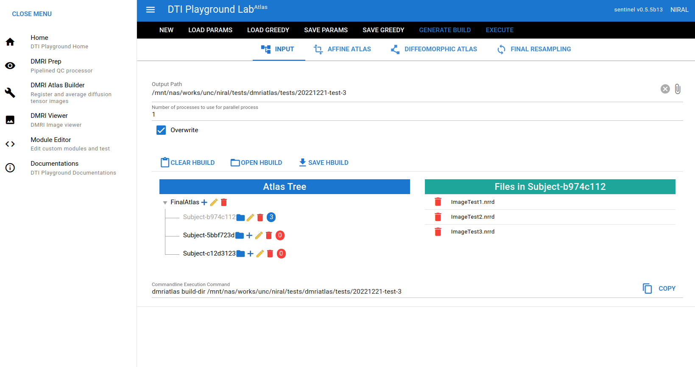

=======================
DMRI Atlas Builder
=======================

dmriatlas is an atlas-building software from diffusion tensor images. It registrates DTIs and averages out to create an atlas image. It supports the hierachical atlas build by using tree structure. A user can make HBUILD file which has all the input file in a structured way (Tree). 

GUI Mode
====================

DTIPlaygroundLab (Web UI)
~~~~~~~~~~~~~~~~~~~~~~~~~~~~

Run::    

    $ dmriplaygroundlab

Then go to DMRI Atlas Builder menu. Once input files is made with IO options (image files, output directory, etc), click GENERATE BUILD button to generate output directory with configuration (config.json) and input files (h-build.json). You can execute with EXECUTE button or use teminal command to start processing::

    $ dmriatlas build-dir <output-directory>

CLI Mode (Mac/Linux/Windows-WSL)
==================================

Users may generate or copy their existing h-build and config files into the output directory and run::

    $ dmriatlas build-dir <output-directory>

Following 3 files should be in <output_dir>/common  directory before running above command

* h-build.json
* config.json
* greedy.json