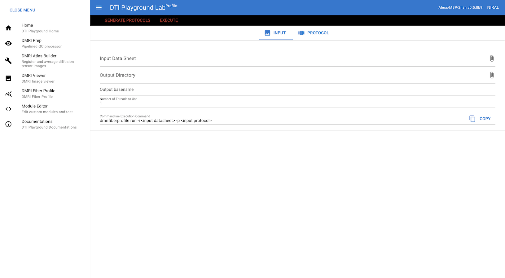
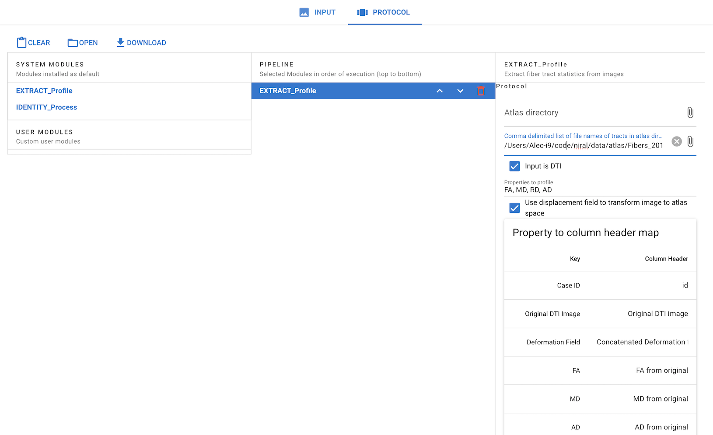

================
DMRIFiberProfile
================

dmrifiberprofile is a tool that analyzes fiber tracts based on DTI volumes or scalar images.

GUI Mode
====================

DTIPlaygroundLab (Web UI)
~~~~~~~~~~~~~~~~~~~~~~~~~~~~

Run::

    $ dmriplaygroundlab

Then go to the DMRIFiberProfile menu. In the INPUT tab, enter the file path to the input datasheet containing the paths to the images to be analyzed.  You can click the paper clip icon to browse for the file in a GUI. Do the same for selecting the output directory.

Next, click on the PROTOCOL tab to define the pipeline. For tract profile extraction, double-click the EXTRACT_Profile module to add it to the pipeline.

Fill in the fields in the EXTRACT_Profile module protocol. You **must** provide a comma-separated list of VTK files to profile. If an atlas directory is provided, these file paths may be relative (e.g., `tract1.vtk`). If no atlas directory is provided, the file paths must be absolute (e.g., `/proj/NIRAL/users/alecj/fibers/tract1.vtk`).

Check the box for "Input is DTI" if the input images are DTI volumes. If the input images are scalar images, uncheck this box. The program will search for scalar images corresponding to the scalar properties you want to profile.

The "Properties to Column Header Map" allows you to map parameters to the column headers in your input datasheet. Default column headers are provided, but they may not match your CSV. If they don't, you can edit the "Column Header" field. For example, if your case IDs are in a column called "Subject ID," you should enter this in the "Column Header" field for the "Case ID" parameter.

Once you've entered the requisite fields, you can click the GENERATE PROTOCOLS button to generate the protocol file. This file will be saved in the output directory you specified in the INPUT tab.

Finally, click the EXECUTE button to run the pipeline. Alternatively, you can copy the command and run it directly in the terminal.::

$ dmrifiberprofile run -i INPUT_DATASHEET -p OUTPUT_DIR/protocols.yml

CLI Mode (Linux/Windows-WSL)
================================

For Windows users, install WSL2 and linux packages with python>=3.8.6.

1. init - Initialize configuration (Default: `$HOME/.niral-dti/dmrifiberprofile-<version>`)
~~~~~~~~~~~~~~~~~~~~~~~~~~~~~~~~~~~~~~~~~~~~~~~~~~~~~~~~~~~~~~~~~~~~~~~~~~~~~~~~~~~~~~~~~~~~~~~~~~~~~~

init command generates the configuration directory and files with following command. 
One just needs to execute this command only once unless a different configuration is 
needed. If you want to reset the initial configuration directory, you can run init again.::

    $ dmrifiberprofile init

If you want to set different config directory other than default one::

    $ dmrifiberprofile --config-dir my/config/dir init

Once run, `config.yml` and `environment.yml` will be in the directory. 

You can manually specify the tool directory (which is generated by `install-tools` command) by `--tools-dir` option.::

    $ dmrifiberprofile init --tools-dir <path/to/tool_dir>

2. update - Update if `config.yml` has been changed (e.g. in case of adding user module directory).
~~~~~~~~~~~~~~~~~~~~~~~~~~~~~~~~~~~~~~~~~~~~~~~~~~~~~~~~~~~~~~~~~~~~~~~~~~~~~~~~~~~~~~~~~~~~~~~~~~~
Changing `config.yml` file should be followed by updating `environment.yml` with running update command ::

    $ dmrifiberprofile [--config-dir my/config/dir] update

This will update module-specific informations such as binary locations or package location used by the corresponding module. It simply updates `environment.yml`

3. make-protocols - Generating a default protocol file
~~~~~~~~~~~~~~~~~~~~~~~~~~~~~~~~~~~~~~~~~~~~~~~~~~~~~~

The first thing to do is generate the default protocol file that has pipeline information::

    $ dmrifiberprofile [base options] make-protocols -i INPUT_DATASHEET  [-o OUTPUT_DIRECTORY] [-d MODULE1 MODULE2 ... ]

if `-o` option is omitted, the output protocol will be printed on terminal.`-d` option specifies the list of modules for the analysis,
with which command will generate the default pipeline and protocols of the sequence. Same module can be used redundantly. If `-d` 
option is not specified, the default pipeline will be generated from the file `protocol_template.yml` . You can change the default 
pipeline in `protocol_template.yml` file.

By default, the only module that will run is `EXTRACT_Profile` which extracts the profile of the fiber tracts provided.

Modifying the default protocol
--------------------------------
If using the `EXTRACT_Profile` module, there are two fields in the default protocol file that **must be modified before running.** These fields are null by default.

1. `atlas` - The directory containing the tracts to be profiled. Must be provided as an absolute path.
2. `tracts` - The list of tracts to be profiled. Must be provided as a comma-separated list of file names (spaces don't matter), including the .vtk extension. These file names will be concatenated with the path specified by `atlas` to form the full path to the tracts.

Optionally, you can also leave the `atlas` field blank and provide a list of absolute file paths in the `tracts` field.

If you try to use this protocol without providing tracts and an atlas, you will receive an error message.

Anatomy of EXTRACT_Profile protocol
-----------------------------------
Below are the options contained in the `EXTRACT_Profile` protocol.

.. code-block:: yaml

    protocol:
        atlas:
            type: directory
            default_value: null
            description: Directory containing a set of fiber tracts in the atlas to be analyzed.

        tracts:
            type: string
            default_value: null
            description: Selected set of tracts to use. Comma-delimited list of file names with .vtk extension included. Each entry must uniquely map to a VTK fiber file in the atlas location.

        inputIsDTI:
            type: boolean
            default_value: true
            description: Specifies whether the input image is a DTI, and properties are derived from it.

        propertiesToProfile:
            type: list
            default_value: FA, MD, RD, AD
            description: List of selected properties to profile along tracts.

        useDisplacementField:
            type: boolean
            default_value: true
            description: Determines whether to convert the image to atlas space using a displacement field. If set to false, the image will not be transformed to atlas space.

        parameterToColumnHeaderMap:
            type: dictionary
            default_value: null
            description: Optional map of parameters (e.g., scalar names, case id) to column headers to use for each property to profile.

        resultCaseColumnwise:
            type: boolean
            default_value: true
            description: Specifies whether to store cases as columns instead of rows in the output CSV.

        planeOfOrigin:
            type: string
            candidates:
                - value: Median
                  description: Origin of profile will be median of tract.
                - value: CoG
                  description: Origin of profile will be center of gravity.
            default_value: Median
            description: Determines the plane that sets the origin of the profile arc length.

        stepSize:
            type: integer
            default_value: 1
            description: Specifies how far along the tract to step for each new fiber profile location.

        supportBandwidth:
            type: integer
            default_value: 1
            description: Specifies the kernel support for DTITractStat.

        noNaN:
            type: boolean
            default_value: false
            description: Specifies whether to remove fibers with NaN values, used both for FiberPostProcess and DTITractStat.

        mask:
            type: file
            default_value: null
            description: Optional mask file to use during profile extraction. The mask has to be defined in atlas space.

Here's an example of what the `EXTRACT_Profile` protocol might look like with the `atlas` and `tracts` fields filled in:

.. code-block:: yaml

    protocol:
      atlas: /proj/NIRAL/users/alecjn/test_scripts/DTIPlayground-Tests/tests/input/fiberprofile/atlas
      inputIsDTI: true
      mask: null
      noNaN: false
      parameterToColumnHeaderMap:
        FA: FA for original
        Original DTI Image: Original DTI
      planeOfOrigin: Median
      propertiesToProfile: FA, MD
      resultCaseColumnwise: true
      stepSize: 1
      supportBandwidth: 1
      tracts: Arc_L_FrontoParietal-2_extracted_done.vtk, Corpus_Callosum-2_extracted_done.vtk
      useDisplacementField: true

4. run - Run pipeline
~~~~~~~~~~~~~~~~~~~~~~~~~
To run with existing protocol file::

    $ dmrifiberprofile run -i INPUT_DATASHEET -p PROTOCOL_FILE -o OUTPUT_DIR

PROTOCOL_FILE is the file generated by `make-protocols` command and appropriately populated with the necessary information.

Development of a new module
===========================

Adding a module
~~~~~~~~~~~~~~~

Once initialized, users can add their custom module from scratch or existing system/user modules by following command::

    $ dmrifiberprofile add-module <module-name> [--base-module <base-module-name>] [--edit]

Following command will generate initial skeletal files of module::

    $ dmrifiberprofile add-module HELLO_World

Then you can test if the module can be loaded properly with::

    $ dmrifiberprofile update

You can use your module right in protocol file.

if `-b` , `--base-module` is specified, new model will copy existing code and data from the base module.
e.g.::

    $ dmrifiberprofile add-module MYFIRST_Module -b EXTRACT_Profile

MYFIRST_Module will have same codes and data (module definition yaml file) from EXTRACT_Profile module with new classname and filenames.

Developer
~~~~~~~~~

Once module is developed and tested in 
the user module directory, one can just
move that directory in `dtiplayground/dmri/fiberprofile/modules` and commit.
Make sure the custom module does not exist in both the user and system module directories.

Removing user module
~~~~~~~~~~~~~~~~~~~~

User module can be removed by::

    $ dmrifiberprofile remove-module <module-name>

e.g.::
    
    $ dmrifiberprofile remove-module MYFIRST_Module

[NOTE] System module cannot be removed by this command. Only user module can be removed.

Modules in other directory
~~~~~~~~~~~~~~~~~~~~~~~~~~
You can just copy module directory to `$HOME/.niral-dti/modules/dmrifiberprofile` and check with 
`$ dmrifiberprofile update` command. Same applies for removal of user modules.

