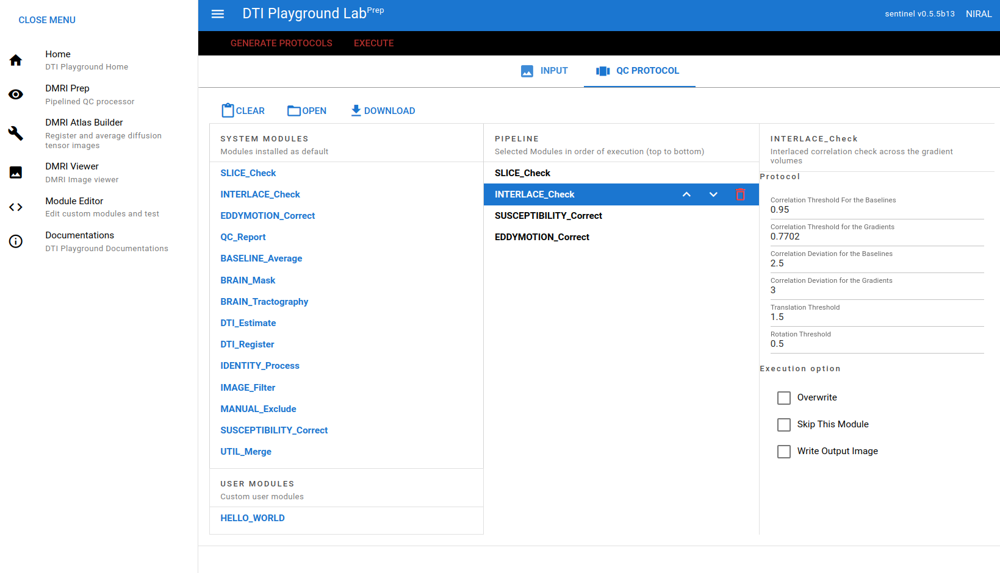

============
DMRI Prep
============

dmriprep is a tool that performs quality control over diffusion 
weighted images. Quality control is very essential preprocess in 
DTI research, in which the bad gradients with artifacts are to be 
excluded or corrected by using various computational methods. The 
software and library provides a module-based package with which users 
can create their own QC pipeline as well as new pipeline modules.

The general framework of dmriprep is:
-	The input is a dMRI/DWI datasets
-	The final output of a workflow/protocol is a dMRI dataset
-	Individual modules might generate their own additional outputs

Thus, for example, a tensor estimation module will write out a tensor image, a tractography module will write out a tractography result, etc, and in addition, the final output that is written at the end of any pipeline (which will be called *QCed.nrrd/QCed.nii.gz depending on format) will be a dMRI/DWI dataset. This final dMRI data is either the output of the last dMRI modifying module in the pipeline or the same as the input dMRI data if the protocol does not contain a module that modifies the dMRI data.

About the Preprocessing part : `README about Preprocessing <https://github.com/NIRALUser/DTIPlayground/blob/master/dtiplayground/dmri/preprocessing/README.md>`_

GUI Mode
====================

DTIPlaygroundLab (Web UI)
~~~~~~~~~~~~~~~~~~~~~~~~~~~~

Run::    

    $ dmriplaygroundlab

Then go to DMRI Prep menu. Once protocol file is made with IO options (image files, output directory, etc), click GENERATE PROTOCOLS button to generate output directory with protocol file. You can execute with EXECUTE button or use teminal command to start processing::

    $ dmriprep run-dir <output-directory>

Legacy UI (Linux only)
~~~~~~~~~~~~~~~~~~~~~~~~~~

When a user run dmriprep-ui first time, it automatically initialize.::

    $ dmriprep-ui

If you haven't installed legacy UI::

    $ pip install dtiplayground-native

CLI Mode (Linux/Windows-WSL)
================================

For Windows users, install WSL2 and linux packages with python>=3.8.6.

1. init - Initialize configuration (Default: `$HOME/.niral-dti/dmriprep-<version>`)
~~~~~~~~~~~~~~~~~~~~~~~~~~~~~~~~~~~~~~~~~~~~~~~~~~~~~~~~~~~~~~~~~~~~~~~~~~~~~~~~~~~~~~~~~~~~~~~~~~~~~~

init command generates the configuration directory and files with following command. 
One just needs to execute this command only once unless a different configuration is 
needed. If you want to reset the initial configuration directory, you can run init again.::

    $ dmriprep init

If you want to set different directory other than default one ::

    $ dmriprep --config-dir my/config/dir init

Once run, `config.yml` and `environment.yml` will be in the directory. 

You can manually specify the tool directory (which is generated by `install-tools` command) by `--tools-dir` option.::

    $ dmriprep init --tools-dir <path/to/tool_dir>

2. update - Update if `config.yml` has been changed (e.g. in case of adding user module directory).
~~~~~~~~~~~~~~~~~~~~~~~~~~~~~~~~~~~~~~~~~~~~~~~~~~~~~~~~~~~~~~~~~~~~~~~~~~~~~~~~~~~~~~~~~~~~~~~~~~~
Changing `config.yml` file should be followed by updating `environment.yml` with running update command ::

    $ dmriprep [--config-dir my/config/dir] update

This will update module-specific informations such as binary locations or package location used by the corresponding module. It simply updates `environment.yml`

3. make-protocols - Generating a default protocol file
~~~~~~~~~~~~~~~~~~~~~~~~~~~~~~~~~~~~~~~~~~~~~~~~~~~~~~

The firstthing to do QC is to generate default protocol file that has pipeline information.::

    $ dmriprep [base options] make-protocols -i IMAGE_FILENAME [-o OUTPUT_FILENAME_] [-d MODULE1 MODULE2 ... ]

if `-o` option is omitted, the output protocol will be printed on terminal.`-d` option specifies the list of modules for the QC, 
with which command will generate the default pipeline and protocols of the sequence. Same module can be used redundantly. If `-d` 
option is not specified, the default pipeline will be generated from the file `protocol_template.yml` . You can change the default 
pipeline in `protocol_template.yml` file

4. run - Run pipeline
~~~~~~~~~~~~~~~~~~~~~~~~~

To run with default protocol generated from `protocol_template.yml`::

    $ dmriprep [base options] run -i IMAGE_FILES -o OUTPUT_DIR -d [MODULE1 MODULE2 ...]

`-d` option (default protocol) works as described in **make-protocols** command. 
But you need to specify `"-d"` for the default pipeline from the template.  
If `-o` option is omitted, default directory will be set to `Image filename_QC`. 
IMAGE_FILES may be a list of files to process. In case of susceptibility correction, 
IMAGE_FILES needs to have counterparts for the polarities. `dmriprep` automatically 
process qc for all the input images before the susceptibility correction stage.

To run with existing protocol file::

    $ dmriprep run -i IMAGE_FILES -p PROTOCOL_FILE -o output/directory/

`-p` option cannot be used with `-d` option.

[NOTE] when using 2 image files for SUSCEPTIBILITY_Correct and other multi input modules, order of files can be important. For the SUSCEPTIBILITY_Correct, AP(FH), RL, SI phased file comes first. (e.g. `$ dmriprep -i AP_img.nrrd PA_img.nrrd ...`)

5. run-dir - Run output directory
~~~~~~~~~~~~~~~~~~~~~~~~~~~~~~~~~~~~~~~~

If an output directory is configured with protocol file, you can run it with following command::

    $ dmriprep run-dir <output-directory>

Output directory can be generated from DTIPlaygroundLab (UI)

Development of a new module
===========================

Adding a module
~~~~~~~~~~~~~~~

Once initialized, users can add their custom module from scratch or existing system/user modules by following command::

    $ dmriprep add-module <module-name> [--base-module <base-module-name>] [--edit]

Following command will generate initial skeletal files of module::

    $ dmriprep add-module HELLO_World

Then you can test if the module can be loaded properly with::

    $ dmriprep update

You can use your module right in protocol file.

if `-b` , `--base-module` is specified, new model will copy existing code and data from the base module.
e.g.::

    $ dmriprep add-module MYFIRST_Module -b SLICE_Check

MYFIRST_Module will have same codes and data (module definition yaml file) from SLICE_Check module with new classname and filenames.

Developer
~~~~~~~~~

Once module is developed and tested in 
the user module directory, one can just
move that directory in `dtiplayground/dmri/preprocessing/modules` and commit.
Make sure the custom module is not existing both in system module directory.

Removing user module
~~~~~~~~~~~~~~~~~~~~

User module can be removed by::

    $ dmriprep remove-module <module-name>

e.g.::
    
    $ dmriprep remove-module MYFIRST_Module

[NOTE] System module cannot be removed by this command. Only user module can be removed.

Modules in other directory
~~~~~~~~~~~~~~~~~~~~~~~~~~
You can just copy module directory to `$HOME/.niral-dti/modules/dmriprep` and check with 
`$ dmriprep update` command. Same applies for removal of user modules.

