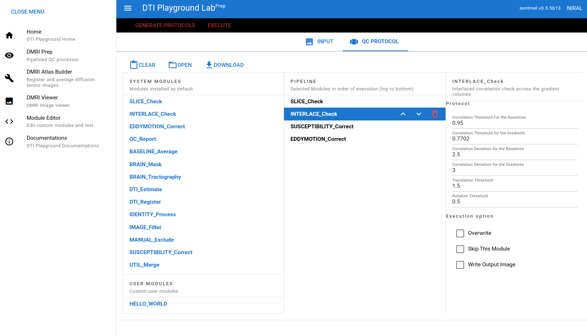

============
DMRI Prep
============

dmriprep is a tool that performs quality control over diffusion 
weighted images. Quality control is very essential preprocess in 
DTI research, in which the bad gradients with artifacts are to be 
excluded or corrected by using various computational methods. The 
software and library provides a module-based package with which users 
can create their own QC pipeline as well as new pipeline modules.

The general framework of dmriprep is:
-	The input is a dMRI/DWI datasets
-	The final output of a workflow/protocol is a dMRI dataset
-	Individual modules might generate their own additional outputs

Thus, for example, a tensor estimation module will write out a tensor image, a tractography module will write out a tractography result, etc, and in addition, the final output that is written at the end of any pipeline (which will be called ``*QCed.nrrd`` / ``*QCed.nii.gz`` depending on format) will be a dMRI/DWI dataset. This final dMRI data is either the output of the last dMRI modifying module in the pipeline or the same as the input dMRI data if the protocol does not contain a module that modifies the dMRI data.

About the Preprocessing part : `README about Preprocessing <https://github.com/NIRALUser/DTIPlayground/blob/master/dtiplayground/dmri/preprocessing/README.md>`_

GUI Mode
====================

DTIPlaygroundLab (Web UI)
~~~~~~~~~~~~~~~~~~~~~~~~~~~~

Run::    

    $ dmriplaygroundlab

Then go to DMRI Prep menu. Once protocol file is made with IO options (image files, output directory, etc), click GENERATE PROTOCOLS button to generate output directory with protocol file. You can execute with EXECUTE button or use teminal command to start processing::

    $ dmriprep run-dir <output-directory>

CLI Mode (Linux/Windows-WSL)
================================

For Windows users, install WSL2 and linux packages with python 3.9 - 3.12 (3.11 recommended).

1. init - Initialize configuration (Default: `$HOME/.niral-dti/dmriprep-<version>`)
~~~~~~~~~~~~~~~~~~~~~~~~~~~~~~~~~~~~~~~~~~~~~~~~~~~~~~~~~~~~~~~~~~~~~~~~~~~~~~~~~~~~~~~~~~~~~~~~~~~~~~

init command generates the configuration directory and files with following command. 
One just needs to execute this command only once unless a different configuration is 
needed. If you want to reset the initial configuration directory, you can run init again.::

    $ dmriprep init

If you want to set different directory other than default one ::

    $ dmriprep --config-dir my/config/dir init

Once run, `config.yml` and `environment.yml` will be in the directory. 

You can manually specify the tool directory (which is generated by `install-tools` command) by `--tools-dir` option.::

    $ dmriprep init --tools-dir <path/to/tool_dir>

2. update - Update if `config.yml` has been changed (e.g. in case of adding user module directory).
~~~~~~~~~~~~~~~~~~~~~~~~~~~~~~~~~~~~~~~~~~~~~~~~~~~~~~~~~~~~~~~~~~~~~~~~~~~~~~~~~~~~~~~~~~~~~~~~~~~
Changing `config.yml` file should be followed by updating `environment.yml` with running update command ::

    $ dmriprep [--config-dir my/config/dir] update

This will update module-specific informations such as binary locations or package location used by the corresponding module. It simply updates `environment.yml`

3. make-protocols - Generating a default protocol file
~~~~~~~~~~~~~~~~~~~~~~~~~~~~~~~~~~~~~~~~~~~~~~~~~~~~~~

The firstthing to do QC is to generate default protocol file that has pipeline information.::

    $ dmriprep [base options] make-protocols -i IMAGE_FILENAME [-o OUTPUT_FILENAME_] [-d MODULE1 MODULE2 ... ]

if `-o` option is omitted, the output protocol will be printed on terminal.`-d` option specifies the list of modules for the QC, 
with which command will generate the default pipeline and protocols of the sequence. Same module can be used redundantly. If `-d` 
option is not specified, the default pipeline will be generated from the file `protocol_template.yml` . You can change the default 
pipeline in `protocol_template.yml` file. With two input images (opposite phase encodings), the default pipeline also has 
SUSCEPTIBILITY_Correct, before EDDYMOTION_Correct.

4. run - Run pipeline
~~~~~~~~~~~~~~~~~~~~~~~~~

To run with default protocol generated from `protocol_template.yml`::

    $ dmriprep [base options] run -i IMAGE_FILES -o OUTPUT_DIR -d [MODULE1 MODULE2 ...]

`-d` option (default protocol) works as described in **make-protocols** command. 
But you need to specify `"-d"` for the default pipeline from the template.  
If `-o` option is omitted, default directory will be set to `Image filename_QC`. 
IMAGE_FILES may be a list of files to process. In case of susceptibility correction, 
IMAGE_FILES needs to have counterparts for the polarities. `dmriprep` automatically 
process qc for all the input images before the susceptibility correction stage.

To run with existing protocol file::

    $ dmriprep run -i IMAGE_FILES -p PROTOCOL_FILE -o output/directory/

`-p` option cannot be used with `-d` option.

[NOTE] when using 2 image files for SUSCEPTIBILITY_Correct and other multi input modules, order of files can be important. For the SUSCEPTIBILITY_Correct, AP(FH), RL, SI phased file comes first. (e.g. `$ dmriprep -i AP_img.nrrd PA_img.nrrd ...`)

Rerunning into an existing output directory
~~~~~~~~~~~~~~~~~~~~~~~~~~~~~~~~~~~~~~~~~~~

A module with a result from a previous run is not recomputed, unless its protocol or the global variables given with
`-g` changed since that run (they are compared with the `settings.yml` stored in the module's folder; that module and
the following ones are then recomputed). `--overwrite` recomputes everything. Results written before 0.7.11 have no
`settings.yml` and are reused with a warning until the run uses `--overwrite`.

Denoising and Gibbs ringing removal
~~~~~~~~~~~~~~~~~~~~~~~~~~~~~~~~~~~

DWI_Denoise (DIPY MP-PCA, the method of MRtrix `dwidenoise`, or Patch2Self) and GIBBS_Correct (DIPY, the method of
MRtrix `mrdegibbs`, for full Fourier acquisitions) are not in the default pipeline. Both assume raw, uninterpolated
data, so put DWI_Denoise first and GIBBS_Correct right after it::

    $ dmriprep run -i image.nii.gz -o out -d DWI_Denoise GIBBS_Correct SLICE_Check INTERLACE_Check EDDYMOTION_Correct QC_Report

MP-PCA also writes the noise level map (`<base>_DWI_noise_sigma.nii.gz`), Patch2Self the RMS of the removed signal
(`<base>_DWI_noise_residual.nii.gz`).

Age appropriate registration target
~~~~~~~~~~~~~~~~~~~~~~~~~~~~~~~~~~~

With a normative model of the reference atlas (DTI_Register option `referenceNormativeModel`, a folder written by
`dmrifiberprofile qc-registration --build-normative`), the DTI is registered to the mean tensor of the age bin of the
subject instead of `referenceImage`. The age is the protocol `age` (or the global variable `age`), else the row of the
scan in `ageCSV`, a participants / sessions table as used by `qc-registration --age-csv` (`ageColumn` and `ageUnits`
describe its age column; the subject and session are read from the path as `sub-<id>` / `ses-<id>`), else `ageRegex`
on the path, ``ses-(\d+)m`` by default. Without any of them the reference image is used, with a warning.

QC outputs
~~~~~~~~~~

Besides the QC report (`QC_report.pdf` and `QC_report.csv` of QC_Report), the modules write tables next to the QCed
image, which are also columns of the QC_Report CSV and of the cohort table of a batch. The per volume tables carry an
`original_index`, the index of the volume in the input of the pipeline.

- `DENOISE_QC.tsv`, `GIBBS_QC.tsv`: noise level and b=0 SNR in the brain (MP-PCA) or the residual of Patch2Self, and
  the mean absolute change of the Gibbs correction.
- `EDDY_motion.tsv`, `EDDY_QC.tsv` (EDDYMOTION_Correct): per volume translations, rotations, framewise displacement
  (Power et al. 2012) and eddy outlier slices, and their summary with the b=0 SNR and the CNR of each shell.
- `DTI_fit.tsv`, `DTI_fit_QC.tsv`, `DTI_fit_carpet.png` (DTI_Estimate): how well each volume and each slice agrees
  with the signal predicted by a WLS tensor fit, and the poorly fitted slices.
- `IMAGE_QC.tsv`, `IMAGE_ndc.tsv`, `IMAGE_QC_plot.png` (QC_Report, option `imageQC`): the same numbers on the raw
  input (`raw_`) and on the preprocessed image (`qced_`) - neighboring DWI correlation, bad slices, and with
  `bTableCheck` the fiber coherence index of the b-table, which names the b-vector axis whose sign would raise it.

See the `README <https://github.com/NIRALUser/DTIPlayground/blob/master/README.md>`_ for the details of each column.

5. run-dir - Run output directory
~~~~~~~~~~~~~~~~~~~~~~~~~~~~~~~~~~~~~~~~

If an output directory is configured with protocol file, you can run it with following command::

    $ dmriprep run-dir <output-directory>

Output directory can be generated from DTIPlaygroundLab (UI)

6. bids / run-batch - Process a cohort
~~~~~~~~~~~~~~~~~~~~~~~~~~~~~~~~~~~~~~~

`bids` processes the DWIs of a BIDS dataset with the BIDS-App interface, locally or as a SLURM job array::

    $ dmriprep bids /data/study /data/study/derivatives/dmriprep participant -p protocol.yml -j 4 -t 2
    $ dmriprep bids /data/study /data/study/derivatives/dmriprep participant -p protocol.yml -t 4 --slurm
    $ dmriprep bids /data/study /data/study/derivatives/dmriprep group

Each DWI run is a dataset; when the protocol needs two images (SUSCEPTIBILITY_Correct), the runs with opposite phase
encoding of a session are processed as pairs, with the phase encoding axis and readout time of the sidecars. `-p`
takes one protocol, or protocols per acquisition (`-p '*acq-dir79*=dir79.yml' other.yml`, first match); `-d [MODULE ...]`
uses the default protocol (as `run -d`), generated for each acquisition; the default pipeline processes the runs with
an opposite phase encoded run as pairs, with SUSCEPTIBILITY_Correct. The output
of each dataset is in `<output_dir>/sub-<label>/[ses-<label>/]dwi/<dataset id>/` (the usual `dmriprep run` output);
`<output_dir>/batch/` holds the manifest, the protocols of the datasets and their state. `--dry-run` lists the
datasets grouped by acquisition. Running the command again processes only the datasets that are not done;
`dmriprep batch-status <output_dir>` shows their state. The `group` level writes a QC table of the cohort and the
datasheet for `dmrifiberprofile`.

`run-batch` does the same for datasets listed in a datasheet (columns `id`, `image_1`, optionally `image_2`,
`protocol`, `output_dir`, `overrides`)::

    $ dmriprep run-batch -m cohort.tsv -o /data/cohort_QC -p protocol.yml -j 4

See the README for all options.

Development of a new module
===========================

Adding a module
~~~~~~~~~~~~~~~

Once initialized, users can add their custom module from scratch or existing system/user modules by following command::

    $ dmriprep add-module <module-name> [--base-module <base-module-name>] [--edit]

Following command will generate initial skeletal files of module::

    $ dmriprep add-module HELLO_World

Then you can test if the module can be loaded properly with::

    $ dmriprep update

You can use your module right in protocol file.

if `-b` , `--base-module` is specified, new model will copy existing code and data from the base module.
e.g.::

    $ dmriprep add-module MYFIRST_Module -b SLICE_Check

MYFIRST_Module will have same codes and data (module definition yaml file) from SLICE_Check module with new classname and filenames.

Developer
~~~~~~~~~

Once module is developed and tested in 
the user module directory, one can just
move that directory in `dtiplayground/dmri/preprocessing/modules` and commit.
Make sure the custom module is not existing both in system module directory.

Removing user module
~~~~~~~~~~~~~~~~~~~~

User module can be removed by::

    $ dmriprep remove-module <module-name>

e.g.::
    
    $ dmriprep remove-module MYFIRST_Module

[NOTE] System module cannot be removed by this command. Only user module can be removed.

Modules in other directory
~~~~~~~~~~~~~~~~~~~~~~~~~~
You can just copy module directory to `$HOME/.niral-dti/modules/dmriprep` and check with 
`$ dmriprep update` command. Same applies for removal of user modules.

