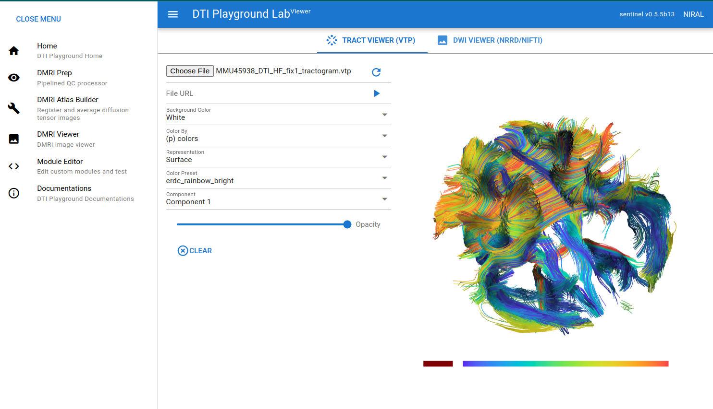
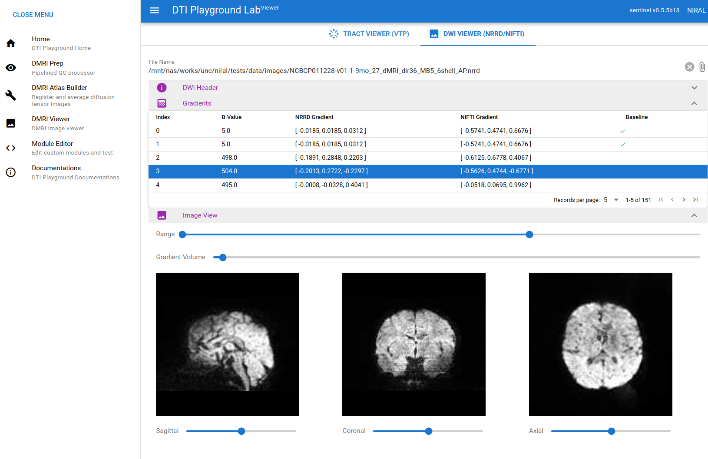

============
DMRI Viewer
============

DMRI Viewer is a utility software to view VTP file or DWI files. It supports VTP format for the geometries and NRRD/NIFTI format for DWIs (4D only)

Tract Viewer (VTP)
====================

Unlike its name, this viewer all kinds of geometry in VTP format.

DWI Viewer (NRRD/NIFTI)
===========================

DWI viewer currently only supports 4d diffusion images. NRRD/NIFTI formats are both supported.

