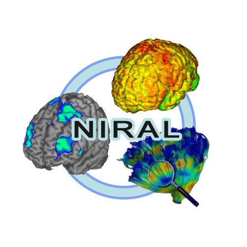

.. DTIPlayground documentation master file, created by
   sphinx-quickstart on Fri Oct  7 06:55:51 2022.
   You can adapt this file completely to your liking, but it should at least
   contain the root `toctree` directive.

DTIPlayground - Integrated DWI processing toolkit
======================================================

.. include:: ../README.rst

.. toctree::
   :maxdepth: 2
   :caption: Contents:

   installation
   DMRIPrep
   DMRIFiberProfile
   DMRIAtlasBuilder
   DMRIViewer
   license

Indices and tables
==================

* :ref:`genindex`
* :ref:`modindex`
* :ref:`search`
